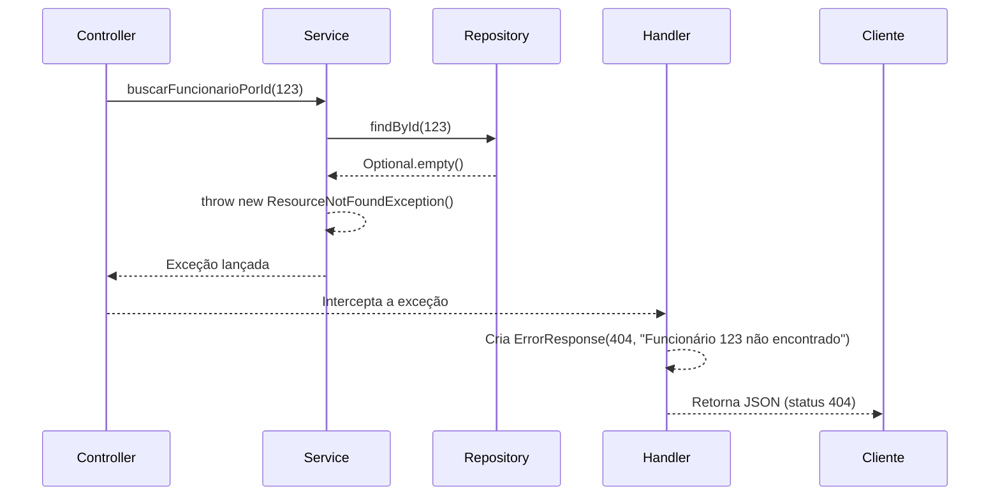

# 📄 Documentação Geral de Responsabilidades

Especificação de responsabilidade de cada arquivo e como eles trabalham juntos no fluxo de tratamento de erros do sistema.

---

## 🔁 Fluxo de um Erro **404 (Não Encontrado)**

1. O **`FuncionarioService`** tenta buscar um funcionário por ID (ex: `123`) no banco.
2. O **`FuncionarioRepository`** retorna um `Optional.empty()`.
3. O **`FuncionarioService`** detecta o `empty()` e lança uma nova exceção:  
   ```java
   throw new ResourceNotFoundException("Funcionário 123 não encontrado");
   ```
4. A exceção sobe até o **`FuncionarioController`**.
5. O **`GlobalExceptionHandler`** (por causa do `@ControllerAdvice`) intercepta a exceção **antes** que ela chegue ao Spring Boot.
6. Ele encontra o método:
   ```java
   @ExceptionHandler(ResourceNotFoundException.class)
   ```
   que é compatível com a exceção lançada.
7. O handler cria um objeto `new ErrorResponse(...)` preenchendo-o com os dados relevantes:
   - Status: `404`
   - Mensagem: `"Funcionário 123 não encontrado"`
8. O handler retorna um `ResponseEntity` contendo o `ErrorResponse` no corpo (`body`) e o status `HttpStatus.NOT_FOUND`.
9. O **Spring Boot** converte o objeto `ErrorResponse` em **JSON** e o envia ao cliente.

---

## 🗂️ Arquivos e Responsabilidades

| Nome do Arquivo | Responsabilidade Principal | Detalhes da Relação |
|------------------|-----------------------------|----------------------|
| **`ErrorResponse.java`** | 🧱 **Definir o Contrato (Estrutura)** | É uma classe DTO (ou `record`) "passiva". Define os campos do JSON de erro. Não possui lógica — apenas representa os dados. |
| **`ResourceNotFoundException.java`** | 🚨 **Sinalizar um Problema** | É o "sinalizador". Sua única responsabilidade é ser **lançada** pela camada de Serviço (`FuncionarioService`) para indicar que um recurso não foi encontrado. |
| **`GlobalExceptionHandler.java`** | 🌐 **Formatar a Resposta** | É o "tradutor". Captura exceções (como a `ResourceNotFoundException`) e as **traduz** para respostas HTTP amigáveis, usando `ErrorResponse` como modelo para o JSON final. |

---

## 🧩 Resumo do Fluxo



---
